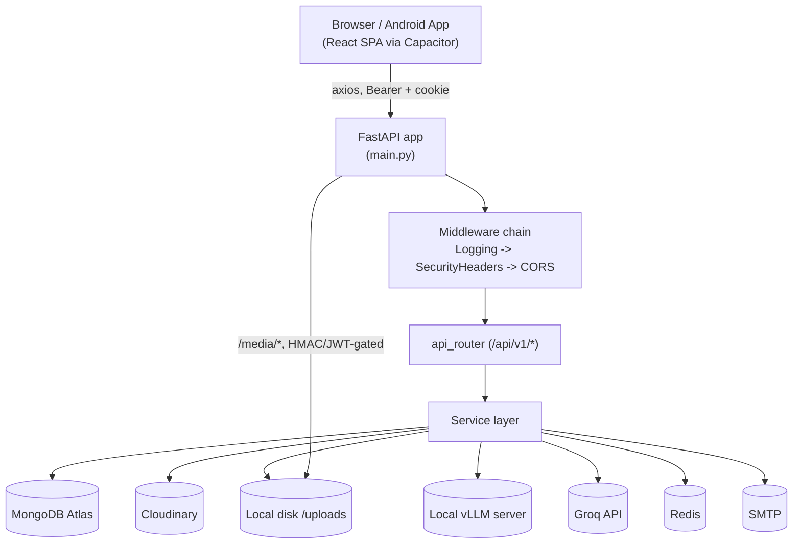
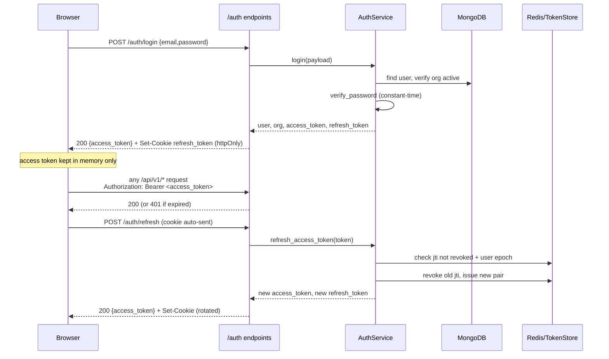
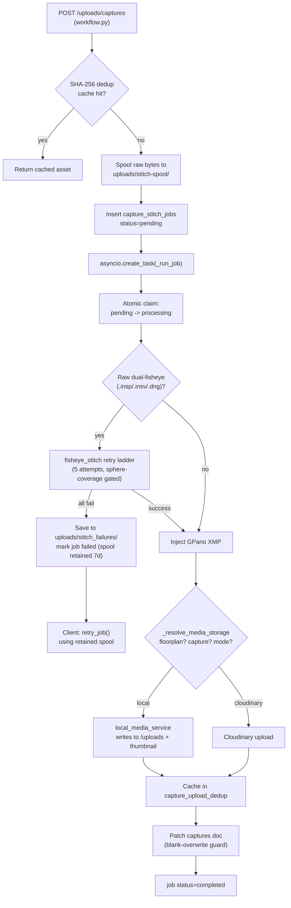
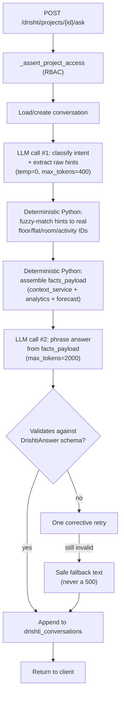
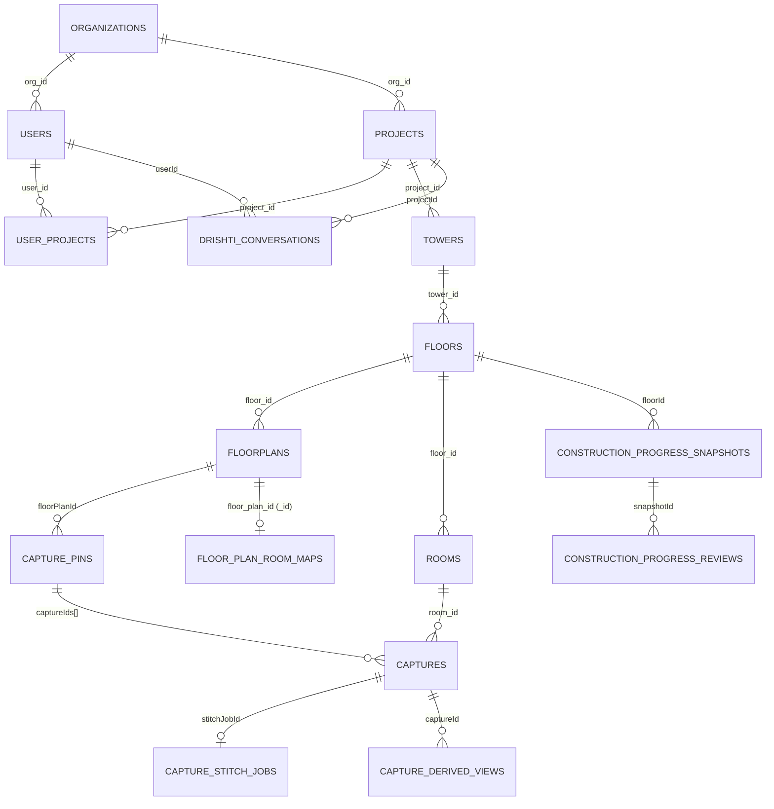

# COMPLETE SYSTEM ARCHITECTURE & FUNCTIONAL UNDERSTANDING

> Reverse-engineered from the repository at `d:/Srivarshini.N/Documents/virtual_room_tour` (branch `predef-pts`) by static analysis only — no code was executed. Every non-trivial claim below is grounded in a file path and, where useful, a line number. Claims are marked **Confirmed** (directly read in source), **Inferred** (reasonably concluded from naming/imports/structure but not directly read line-by-line), or **Unknown** (could not be determined from available code).

---

## 1. Executive Overview

**SiteVision** (branded "SiteVision" by "SiteSureLabs"; internal storage keys and one legacy design doc still say `sitesurelabs`/`Defectra`, see §23) is a construction-site progress-tracking and virtual-tour platform. **Confirmed** from `README.md:1-5` and `backend/app/core/config.py:24`.

In plain terms, it lets a construction company:

1. Set up a **project → tower → floor → flat/room** hierarchy, and upload a **floor plan** image/PDF per floor.
2. Place **numbered capture pins** on the floor plan marking where a photo/360° photo should be taken.
3. Have **field engineers** walk the site with an Insta360 X3 camera (WiFi/OSC-controlled from the app) or a phone camera, capturing a raw dual-fisheye photo or flat photo at each pin.
4. Automatically **stitch** raw dual-fisheye captures into an equirectangular 360° panorama on the backend (asyncio background job), store it (local disk or Cloudinary), and attach it to the pin/room.
5. **Publish** a floor's captures as a sequential 360° walkthrough ("Virtual Tour") that any role can browse in a Photo Sphere Viewer.
6. Run an **AI vision model** over captures to assess construction-finishing progress per room/activity (tiling, painting, MEP, etc.), producing per-floor snapshots, heatmaps, and Excel/PDF reports.
7. Ask **"Drishti"**, an AI assistant, natural-language questions about a project's progress; Drishti answers using a deterministic retrieval+ranking pipeline over the stored snapshots, with an LLM used only to phrase the final prose (see §11).
8. Run as a **web app** (React/Vite SPA) and, via Capacitor, as an **Android field app** with an offline-durable capture/upload queue for engineers working in low/no-connectivity site conditions.

**Confirmed.**

---

## 2. Repository Structure

```
virtual_room_tour/
├── .env                          # root-level env (not read for values; git-ignored)
├── render.yaml                   # Render.com deploy config for both services
├── README.md                     # user-facing workflow doc ("SiteVision" branding)
├── style.md                      # design-token doc — references a DIFFERENT/older
│                                  #   frontend structure ("Defectra" branding, plain
│                                  #   CSS files) — likely stale, see §23/§25
├── v4_2_new.md, v4_2_stage_aware.md   # exported AI-analysis snapshot reports (NOT specs)
├── manual_review.json, manual_review_afterv4.json  # human-review correction log +
│                                  #   filtered extract used as regression fixture data
├── new.py                        # UNRELATED scratch file (LangGraph job-app snippet,
│                                  #   does not import-resolve, not part of the app)
├── uploads/                      # local media storage root (MEDIA_STORAGE=local)
│   ├── SiteVision/{captures,floorplans}/<org_id>/...
│   ├── stitch-spool/              # raw .insp bytes awaiting/retained for stitch jobs
│   └── stitch_failures/           # rejected stitch attempts (.jpg + .json sidecar)
├── docs/                         # this file, + room-extraction-design-study.md
├── backend/
│   ├── pyproject.toml            # Python 3.12+, FastAPI/Motor/Mongo stack
│   ├── .env.example              # documented env vars (see §22)
│   ├── app/
│   │   ├── main.py               # FastAPI app factory, lifespan, /media route, /health
│   │   ├── api/v1/
│   │   │   ├── router.py         # mounts all endpoint routers under /api/v1
│   │   │   └── endpoints/        # auth, organizations, users, user_projects, workflow,
│   │   │                         #   uploads, progress_analysis, construction_progress,
│   │   │                         #   drishti  (see §7 for full route inventory)
│   │   ├── core/                 # config, security (JWT/bcrypt), permissions (system-role
│   │   │                         #   matrix), dependencies (DI/guards), exceptions,
│   │   │                         #   rate_limit, token_store (Redis/memory)
│   │   ├── db/                   # mongodb.py (connection), indexes.py (~26 collections)
│   │   ├── middleware/           # cors.py, logging.py, security_headers.py — all pure-ASGI
│   │   ├── models/                # Pydantic Mongo-document models: user, organization,
│   │   │                         #   user_project
│   │   ├── repositories/         # thin Motor-query wrappers: base, user, organization,
│   │   │                         #   user_project
│   │   ├── schemas/               # Pydantic request/response DTOs: auth, user,
│   │   │                         #   organization, user_project, drishti, progress_analysis
│   │   ├── services/              # business logic — the largest layer (~45 files):
│   │   │                         #   auth/user/org/RBAC, upload+stitch+panorama pipeline,
│   │   │                         #   construction-progress AI pipeline + providers,
│   │   │                         #   Drishti assistant stack, pin/room-map services
│   │   │   ├── construction_progress_providers/  # vllm/anthropic/hybrid providers,
│   │   │   │                                      #   activities.py (frozen checklist),
│   │   │   │                                      #   precedence.py, visual_criteria.py
│   │   │   └── vision_providers/  # groq/vllm (wired) + gemini/openai (DEAD CODE, see §11)
│   │   └── workers/               # EMPTY — no background-worker package exists (see §13)
│   └── tests/
│       ├── conftest.py           # mongomock_motor fixtures, seeded org/users, JWT helpers
│       ├── unit/                 # ~31 files — mostly pure-function/algorithm tests
│       └── integration/          # 3 files — HTTP-level auth/RBAC/org-isolation tests
└── frontend/
    ├── package.json              # React 19, Vite 8, MUI 9, Zustand 5, React Query 5,
    │                             #   Photo Sphere Viewer, Capacitor 8, jsPDF/html2canvas
    ├── vite.config.js            # path aliases, dev proxy → 127.0.0.1:8002
    ├── vercel.json                # alternate static-host SPA rewrite config
    ├── capacitor.config.ts       # appId com.sitevision.fieldapp, webDir dist
    ├── android/                  # generated Capacitor Android/Gradle project
    └── src/
        ├── router/                # index.tsx (route tree), guards.tsx (role guards)
        ├── store/                 # 18 Zustand stores — auth, workflow (domain data),
        │                         #   offline write/upload queues, tombstones, session
        │                         #   isolation, persistence keys
        ├── services/               # axios-based API client + per-feature service modules
        ├── features/auth/         # login/reset pages, hooks, zod schemas, services
        ├── pages/                 # one folder per feature area (Drishti, Tours,
        │                         #   CaptureWorkflow, ConstructionProgress, FloorPlans,
        │                         #   Users, Organizations, Admin, Reviews, ...)
        ├── components/             # ConstructionProgress/*, ProgressReport/*, drishti/*,
        │                         #   upload/*, viewer helpers, navbar/sidebar
        ├── shared/components/      # generic design-system components (Button, Modal,
        │                         #   DataTable, ConfirmDialog, LoadingScreen, ...)
        ├── plugins/                # insta360Camera.ts — custom Capacitor native plugin
        ├── types/                  # dto.ts (mirrors backend Pydantic schemas), drishti.ts
        ├── utils/                  # PDF/Excel export, capture ownership, media URL helpers
        └── hooks/                  # useDrishti.ts, useOrganization.ts (React Query)
```

**Confirmed** (directory listing + all files named above were opened or grepped by this investigation or its sub-agents).

---

## 3. Technology Stack

### Backend — `backend/pyproject.toml` (Confirmed, full file read)

Python `>=3.12`. Exact pinned/floor versions:

| Package | Version | Role |
|---|---|---|
| fastapi | 0.110.0 | Web framework |
| uvicorn | 0.28.0 | ASGI server |
| motor | 3.3.2 | Async MongoDB driver |
| pymongo | 4.6.2 | Sync Mongo driver (used by motor internally / bson) |
| mongomock-motor | ≥0.0.36 | In-process Mongo mock for tests |
| pydantic / pydantic-settings | 2.6.4 / ≥2.2.1 | Schemas + settings |
| python-jose[cryptography] | 3.3.0 | JWT encode/decode |
| passlib[bcrypt] | 1.7.4 | Password hashing (with a direct-bcrypt fast path, see §9) |
| python-multipart | 0.0.9 | Multipart/form uploads |
| cloudinary | 1.39.1 | Media CDN/storage SDK |
| pillow | 10.2.0 | Image processing |
| piexif / exifread | 1.1.3 / 3.0.0 | EXIF metadata read/write |
| pymupdf | ≥1.28.2 | PDF→image rasterization (floor plans) |
| httpx | 0.27.0 | Async HTTP client (LLM/vision API calls) |
| redis | 5.0.3 | Refresh-token revocation + rate-limit store |
| slowapi | ≥0.1.9 | Rate limiting |
| loguru | 0.7.2 | Logging |
| celery | 5.3.6 | **Declared but UNUSED — dead dependency, see §13/§25** |
| emails | ≥1.1.2 | SMTP email sending |
| pytest / pytest-asyncio | ≥9.0.3 / ≥1.4.0 | Test framework |

No `[tool.pytest.ini_options]`, `[tool.ruff]`, or other `[tool.*]` sections exist in `pyproject.toml` — **Confirmed** no linter/pytest config file anywhere in `backend/` (no `pytest.ini`/`setup.cfg`/`tox.ini`).

### Frontend — `frontend/package.json` (Confirmed, full file read)

| Package | Version | Role |
|---|---|---|
| react / react-dom | ^19.2.7 | UI framework |
| react-router-dom | ^7.17.0 | Routing |
| @tanstack/react-query | ^5.101.0 | Server-state cache (used sparingly, see §6) |
| zustand | ^5.0.14 | Global client state (the primary state mechanism) |
| axios | ^1.17.0 | HTTP client |
| @mui/material, @mui/icons-material | ^9.1.1 | Component library |
| @emotion/react, @emotion/styled | ^11.14.x | MUI's styling engine |
| @photo-sphere-viewer/core, /autorotate-plugin | ^5.14.1 | 360° panorama viewer |
| photo-sphere-viewer | ^4.8.1 | Older major version also present (duplication, see §23) |
| react-hook-form + @hookform/resolvers + zod | ^7.78/^5.4/^4.4 | Form validation |
| jwt-decode | ^4.0.0 | Client-side JWT decoding |
| html2canvas + jspdf | ^1.4.1 / ^4.2.1 | PDF export (progress reports, Drishti chat) |
| pdfjs-dist | ^4.4.168 | PDF rendering |
| exceljs | ^4.4.0 | Excel export |
| dayjs | ^1.11.21 | Date formatting |
| react-toastify | ^11.1.0 | Toast notifications |
| framer-motion | ^12.42.0 | Animation |
| @capacitor/core, /android, /filesystem, /network, /preferences, /share | ^8.x | Native Android bridge |
| typescript | ^5.8.3 | Type system |
| vite, @vitejs/plugin-react | ^8.0.16 / ^6.0.2 | Build tool |

No `test`/`vitest`/`jest` script or dependency exists — **Confirmed**. Two `.test.ts` files exist (`src/utils/captureMedia.test.ts`, `src/utils/captureOwnership.test.ts`) but there is **no test runner wired up to execute them** (see §20).

---

## 4. High-Level Architecture

```
                                   ┌────────────────────────────┐
                                   │   Android app (Capacitor)   │
                                   │  webDir=dist, appId         │
                                   │  com.sitevision.fieldapp    │
                                   └──────────────┬──────────────┘
                                                  │  (same SPA bundle)
┌──────────────────┐   HTTPS/axios   ┌────────────▼─────────────┐
│  Browser (React   │◄───────────────┤  React SPA (Vite build)   │
│  SPA, desktop/LAN)│  cookie+Bearer │  Zustand stores, React    │
└──────────────────┘                │  Query (Drishti/Org only) │
                                     └────────────┬──────────────┘
                                                  │ /api/v1/*  (Bearer access token)
                                                  │ /api/v1/auth/refresh (httpOnly cookie)
                                                  │ /media/*   (HMAC-signed or JWT)
                        ┌─────────────────────────▼──────────────────────────┐
                        │                 FastAPI app (main.py)               │
                        │  Middleware: RequestLogging → SecurityHeaders → CORS│
                        │  Exception handlers → api_router (/api/v1/*)        │
                        └───┬───────────┬───────────┬───────────┬────────────┘
                            │           │           │           │
                 ┌──────────▼──┐ ┌──────▼─────┐ ┌───▼────────┐ ┌▼─────────────┐
                 │ auth.py      │ │ workflow.py │ │ construction│ │ drishti.py    │
                 │ organizations│ │ (monolithic │ │ _progress.py│ │ progress_     │
                 │ users.py     │ │ CRUD: proj/ │ │ progress_   │ │ analysis.py   │
                 │ user_projects│ │ tower/floor/│ │ analysis.py │ │               │
                 │              │ │ room/capture│ │             │ │               │
                 │              │ │ /tour/pin/  │ │             │ │               │
                 │              │ │ defect/notif│ │             │ │               │
                 └──────┬───────┘ └──────┬──────┘ └──────┬──────┘ └───────┬───────┘
                        │                │               │                │
             ┌──────────▼────────────────▼───────────────▼────────────────▼──────────┐
             │                        Service layer                                   │
             │  auth_service, user_service, organization_service, rbac_service,       │
             │  capture_stitch_service (asyncio jobs) → cloudinary_service →          │
             │    fisheye_stitch (dual-fisheye→equirect) / local_media_service,       │
             │  construction_progress_service → construction_progress_providers/*     │
             │    (vllm default | anthropic (unwired) | hybrid) → panorama_views      │
             │    (perspective-view rig cache) → room_map_service / flat_finishing_   │
             │    rosters / pin_orphan_service / predefined_pins_service,             │
             │  drishti_service → drishti_query_planner (LLM classify + deterministic │
             │    fuzzy-match) → drishti_context_service/drishti_analytics/           │
             │    drishti_forecast_service (all pure Python) → drishti_llm_client     │
             │    (LLM call #2: phrase final answer only)                             │
             └──────────┬───────────────────────────────────────────┬────────────────┘
                        │                                           │
             ┌──────────▼──────────┐                    ┌───────────▼────────────┐
             │  MongoDB (Motor)     │                    │ External services       │
             │  ~26 collections,    │                    │ • Cloudinary (floor     │
             │  see §8              │                    │   plans always; capture │
             │                      │                    │   fallback)             │
             └──────────────────────┘                    │ • Local disk /uploads   │
                                                          │   (captures, default)  │
                                                          │ • Local vLLM server     │
                                                          │   (VLLM_BASE_URL) —     │
                                                          │   construction-progress │
                                                          │   vision + Drishti LLM  │
                                                          │ • Groq API (vision,     │
                                                          │   prod default + room-  │
                                                          │   map extraction)       │
                                                          │ • Redis (token revoke + │
                                                          │   rate limit)           │
                                                          │ • SMTP (password reset) │
                                                          └─────────────────────────┘
```

**Confirmed**, synthesized from `main.py`, `api/v1/router.py`, and the full service-layer investigation above.

---

## 5. Component Inventory

| Component | Location | Technology | Responsibility | Depends On |
|---|---|---|---|---|
| React SPA | `frontend/src/` | React 19, Vite, MUI | All UI, role-based routing, offline queueing | Backend API, Capacitor (native) |
| Capacitor Android shell | `frontend/android/`, `frontend/capacitor.config.ts` | Capacitor 8 | Wraps SPA as a native app; hosts custom Insta360 plugin | Same SPA bundle |
| Insta360 native plugin | `frontend/src/plugins/insta360Camera.ts` (+ native Android code, not in `src/`) | Capacitor plugin bridge | WiFi/OSC control of Insta360 X3: connect, capturePhoto, disconnect | Camera's local WiFi AP |
| FastAPI app | `backend/app/main.py` | FastAPI, Uvicorn | HTTP entrypoint, middleware, lifespan (DB connect, index creation, stitch-job recovery) | MongoDB, all services |
| Auth subsystem | `core/security.py`, `core/token_store.py`, `services/auth_service.py`, `api/v1/endpoints/auth.py` | JWT (jose), bcrypt, Redis | Register/login/refresh/logout/reset-password | Mongo `users`, Redis (optional) |
| RBAC (two-level) | `core/permissions.py` (system-role), `services/rbac_service.py` (project-role) | Pure Python | Authorization gate at endpoint (system role) and service/query (project role) levels | Mongo `user_projects` |
| Workflow CRUD | `api/v1/endpoints/workflow.py` (2566 lines) | FastAPI | Projects/towers/floors/flats/rooms/captures/tours/floor-plans/pins/defects/notifications/audit-logs/media-dashboard | Nearly every service module |
| Upload/Stitch pipeline | `services/cloudinary_service.py`, `capture_stitch_service.py`, `fisheye_stitch.py`, `local_media_service.py`, `panorama_service.py` | Pillow, OpenCV-style numeric stitching, Cloudinary SDK | Raw dual-fisheye → equirectangular JPEG, hybrid local/Cloudinary storage | Local disk `/uploads`, Cloudinary |
| Construction-progress AI engine | `services/construction_progress_service.py`, `construction_progress_providers/*` | vLLM (local) / Groq / Anthropic (unwired) | Floor-wide checklist-based finishing-% assessment per room/activity | `panorama_views.py` (perspective crops), Mongo snapshots |
| Progress-Analysis (pairwise compare) | `services/ai_progress_service.py`, `vision_providers/*` | vLLM / Groq vision | Before/after image-pair AI comparison (legacy/separate feature from #above) | Cloudinary/local image fetch |
| Drishti assistant | `services/drishti_service.py` + `drishti_query_planner/analytics/forecast/context_service/llm_client/prompts.py` | Local vLLM (JSON-mode chat) + deterministic Python | NL Q&A over project progress data | Mongo snapshots, `drishti_conversations` |
| Pin/Room-map services | `predefined_pins_service.py`, `pin_orphan_service.py`, `room_map_service.py`, `flat_finishing_rosters.py` | Vision LLM (room-map) + deterministic Python | Pin↔room↔flat attribution, orphan-pin recovery, canonical room rosters | `floor_plan_room_maps`, `capture_pins` |
| MongoDB | Atlas (`MONGO_URI`) | MongoDB, Motor driver | System of record for all entities | — |
| Cloudinary | External SaaS | Cloudinary | Floor-plan image hosting (always) + capture fallback storage | — |
| Local vLLM server | External process (`VLLM_BASE_URL`, default `127.0.0.1:8000`) | OpenAI-compatible chat/vision API | Construction-progress vision assessment + Drishti LLM calls | — |
| Groq API | External SaaS | Groq | Production-default vision provider + room-map OCR extraction | — |
| Redis | External/optional | Redis | Refresh-token revocation list, rate-limit bucket store | — |

**Confirmed.**

---

## 6. Frontend Architecture

### Routing — `frontend/src/router/index.tsx`, `guards.tsx` (Confirmed)

Built with `createBrowserRouter` (`index.tsx:87`). Three layout groups: `LandingLayout` (public marketing), `PublicLayout` (auth pages, wrapped in `GuestRoute`), `DashboardLayout` (wrapped in `ProtectedRoute`, everything else). Inside the protected tree, routes are further gated by role wrappers: `AdminRoute` (`admin`/`super_admin`), `ManagerRoute` (`manager`), `ManagerOrAdminRoute`, `FieldEngineerRoute` — all built on a generic `RoleRoute` (`guards.tsx:22-40`) that redirects a wrong-role user to *their own* dashboard (`getRoleLandingPath`), not a blind `/dashboard`. Every page is `lazy()`-loaded behind `Suspense`+`LoadingScreen`. Role type: `AppRole = 'admin' | 'manager' | 'field_engineer' | 'super_admin'` (`store/authStore.ts:8`).

Notable routes: `/dashboard/{admin,manager,engineer}`, `/floor-plans/:projectId/:towerId/:floorId`, `/tours/:tourId`, `/drishti/:projectId`, `/construction-progress/:floorId[/flats|/common]`, field-engineer-only `/capture-workflow`, `/publish-tours`, `/upload-queue`; admin-only `/organizations`, `/admin/media`, `/admin/audit`, `/settings`, dev-only `/dev/drishti-pdf-preview`.

### State management — `frontend/src/store/` (18 files) (Confirmed)

**No React Context is used anywhere** in the app (`grep "createContext"` → zero matches). All state is Zustand:

- `authStore.ts` — access token **in memory only**, never persisted; `{user, sessionKind}` persisted via `zustand/persist` with a `partialize` that strips the token/`isAuthenticated` flag.
- `workflowStore.ts` — the large domain store (projects/towers/floors/flats/rooms/captures/tours/floorPlans/capturePins/defects/notifications/auditLogs/users).
- `fileUploadQueue.ts` / `writeQueue.ts` / `pendingUploadRegistry.ts` — offline-durable queues (see §6 Offline below).
- `tombstones.ts` — suppresses server re-hydration of locally-deleted entities.
- `sessionIsolation.ts` — wipes localStorage on login/logout to prevent cross-user bleed.
- `persistence.ts` — central store-key registry + `clearAllPersistedStorage()`.
- `safeStorage.ts` — try/catch localStorage wrapper (handles quota errors).
- `organizationStore.ts`, `userStore.ts`, `settingsStore.ts`, `favoriteToursStore.ts`, `tourFilters.ts`, `workflowSelectors.ts`, `pruneOrphanedPins.ts`, `resetApplicationData.ts`.

### API client layer — `frontend/src/services/apiClient.ts` (Confirmed, full file read)

Single axios instance, `baseURL: API_V1_URL`, `withCredentials: true` (sends the httpOnly refresh cookie), `timeout: 180_000` ms (sized for large Insta360 multipart uploads over slow/tunnel connections, `apiClient.ts:13-24`). Request interceptor attaches `Authorization: Bearer <token>` from `authStore` and strips the default JSON `Content-Type` for `FormData` bodies. Response interceptor handles 401: distinguishes **offline** (network unreachable → reject this one request, keep session, never log out — explicit design decision for field engineers in dead zones) from **no-session** (server confirmed the cookie is invalid → clear state, hard-redirect to `/login`) via `sessionRefresh.ts`'s `restoreSessionFromCookie()`, which dedups concurrent refresh calls with an in-flight promise. Per-feature service modules (`authService`, `captureService`, `tourService`, `drishtiService`, `uploadService`, etc.) sit on top of this client.

### React Query usage (Confirmed)

Used **sparingly** — only `useDrishti.ts` and `useOrganization.ts` use `useQuery`/`useMutation`. Everything else (projects, towers, floors, captures, tours) flows through the Zustand `workflowStore`, populated by a `WorkflowApiBootstrap` component. Global `QueryClient` config (`App.tsx:11-18`): `staleTime: 5 min`, `retry: 1`.

### Drishti chat UI — `pages/Drishti/`, `components/drishti/` (Confirmed)

`DrishtiChatPage.tsx` — sidebar of past conversations (rename via inline dialog → `PATCH /drishti/conversations/{id}`, delete with `ConfirmDialog`) + main chat column. Optimistic user-message rendering before the mutation resolves; active conversation id synced to the URL query string (`?c=`). PDF export button calls `exportDrishtiChatPdf()` (`utils/drishtiChatPdf.ts`), which builds HTML from the conversation and delegates to a shared `exportHtmlToPdf()` (`utils/htmlToPdf.ts`) that branches on `Capacitor.isNativePlatform()` — web uses html2canvas+jsPDF+browser download, native uses `@capacitor/filesystem` (`Directory.Cache`) + `@capacitor/share` (matches project memory "native-pdf-export").

### Panorama/Tour viewer — `pages/Tours/TourViewerPage.tsx` (Confirmed; no separate `components/viewer/` directory exists — the logic lives in this one 1878-line page)

Uses `@photo-sphere-viewer/core` + `AutorotatePlugin`, dynamically imported. A `classifyProjection()` helper (`:543-594`) samples image corner luminance to distinguish `dualfisheye` (raw unstitched — rendered via PSV's `DualFisheyeAdapter`) vs `equirectangular` (rendered normally) vs `flat` (plain ``, no sphere) — a client-side safety net independent of the backend's own stitch-success validation. GPano orientation metadata is re-derived client-side (`gpanoFromStitch()`) since Cloudinary strips embedded XMP. Walkthrough navigation is **not** PSV hotspots — steps are derived from floor-plan capture pins sorted by `sequenceNumber`, each resolving its panorama from the pin's latest capture. Per-pin capture history renders as a `CaptureTimeline`/compare-mode UI feeding into an "Analyze progress" AI comparison call.

### Capture/Upload flow — `pages/CaptureWorkflow/CaptureWorkflowPage.tsx` (2346 lines), `features/capturePins/` (Confirmed)

4-step wizard (`project → tower → floor → capture`) with per-user last-location persistence. Camera source is a sticky per-device localStorage choice (`'device'` vs `'insta360'`, defaulting to Insta360). The Insta360 path uses the custom `insta360Camera` Capacitor plugin (WiFi OSC: `connect`/`capturePhoto`/`disconnect`); the phone-camera path uses `CameraCaptureDialog.tsx` (a live preview, not a bare file input) or, for desktop, a plain `<input type="file" capture="environment">`/multi-file input accepting `.jpg/.jpeg/.png/.dng/.insp/.insv` (`CaptureWorkflowPage.tsx:2265,2323-2325`, confirmed directly). Pins render with upload-sequence-based numbering (not layout order), status-colored teardrops (`queued/uploading/processing/failed`), long-press-to-place-and-capture in one gesture (Insta360 only), and pan/zoom with `data-no-pan` escape hatches on toolbar buttons for the pointer-capture gotcha noted in project memory.

### Floor plan / pin viewer — `pages/FloorPlans/FloorPlanViewerPage.tsx` (Inferred structure, not read line-by-line)

Shares `workflowSelectors` (`getFloorPlanByFloor`, `getCapturePinsByFloorPlan`) and pin-label utilities (`utils/pinLabels.ts`) with the capture workflow; presumed to be a read-only variant of the same pan/zoom + numbered-pin renderer, without the long-press-to-capture gesture.

### Construction Progress dashboard — `components/ConstructionProgress/*` (10 components) (Confirmed component list; `EvidenceLightbox.tsx` fully read)

`ProgressRing`, `ExecutiveSummaryPanel`, `ActivitySection`/`ActivityCard`, `ProgressComparisonView`, `ProgressTimelineChart`, `SummaryCardsRow`, `ProgressReviewDialog`, `FloorPlanHeatmapOverlay`, `EvidenceLightbox`. `EvidenceLightbox.tsx` fetches each cited capture individually via `GET /captures/{id}` (a raw, differently-shaped endpoint from the `CaptureResponse` DTO used elsewhere — documented root cause of a prior "broken image" bug) and renders a thumbnail grid with a full-size modal viewer.

### Local/session storage (Confirmed via grep)

Access token: **memory only, never persisted**. Persisted localStorage keys include `AUTH_STORE_KEY`, `WORKFLOW_STORE_KEY`, `SETTINGS_STORE_KEY`, `USER_STORE_KEY`, `FAVORITE_TOURS_STORE_KEY` (all versioned via `STORE_VERSION`), plus offline-queue mirrors, a tombstone set, session-isolation markers, and two capture-workflow conveniences (`sitesurelabs-last-capture-location-v1:<userId>`, `sitesurelabs-camera-source-v1`). No `sessionStorage` usage found (not exhaustively verified).

### Offline / Capacitor specifics (Confirmed)

`capacitor.config.ts` declares zero native plugins beyond the framework itself; native behavior is wired ad hoc via `@capacitor/filesystem`, `@capacitor/share`, and the custom Insta360 plugin. The offline-durable upload design (`store/fileUploadQueue.ts`, extensively commented) is memory-first (register + start upload immediately) with **background** disk durability via chunked base64 writes (`DISK_CHUNK_BYTES = 256KB`) to avoid OOM-killing the WebView on ~12MB Insta360 files; caps live `File` handles at `MAX_MEMORY_FILES = 2`, serializes uploads to one at a time, retries up to `MAX_ATTEMPTS = 10` with exponential backoff, and polls stitch-job status faster (`STITCH_POLL_MS = 4s`) than idle polling (`POLL_MS = 20s`). A parallel `writeQueue.ts` makes pin/capture **metadata** durable the same way. No explicit `@capacitor/network` listener was conclusively found — network state appears to be inferred reactively from failed API calls rather than polled proactively (**Inferred**, flagged as unconfirmed by the researching sub-agent).

---

## 7. Backend Architecture

### App structure — `backend/app/main.py` (Confirmed, full file read)

`create_app()` factory (`main.py:68-177`):
- **Lifespan** (`main.py:27-63`): `connect_db()` → best-effort `create_indexes()` → best-effort `CaptureStitchService.recover_orphaned_jobs()` (re-dispatches asyncio-based stitch jobs orphaned by a process restart) → yield → `close_db()`.
- **Middleware order** (comment `main.py:82-85`): `RequestLoggingMiddleware` added first (innermost, runs after CORS) → `SecurityHeadersMiddleware` → `CORSMiddleware` added last (outermost, sees preflights first).
- **Rate limiting**: slowapi `limiter` registered on `app.state` with a `RateLimitExceeded` handler, no-op safely if the limiter failed to build.
- **Exception handlers**: `AppException` → structured JSON envelope; `RequestValidationError` → flattened field errors; catch-all `Exception` → generic 500 (with a `ClientDisconnected` special-case returning empty 200, since that's normal SPA navigation behavior, not a server error).
- **Routers**: `app.include_router(api_router, prefix="/api/v1")`.
- **`/media/{file_path:path}`** (`main.py:118-141`): auth-gated (HMAC signature or JWT) local-file server for `MEDIA_STORAGE=local`, with a path-traversal guard (`full.relative_to(root)`).
- **`/`, `/health`, `/health/ready`**: unauthenticated meta endpoints; `/health` never touches the DB (pure liveness), `/health/ready` pings Mongo (readiness).

### Route registration — `backend/app/api/v1/router.py` (Confirmed)

All routers mounted with no additional prefix (the `/api/v1` prefix is applied once in `main.py`). Registered: `auth`, `organizations`, `users`, `user_projects`, `workflow`, `uploads`, `progress_analysis`, `construction_progress`, `drishti`. Several router imports for `projects`/`towers`/`floors`/`rooms`/`captures`/`tours`/`analytics`/`search` are **commented out as "Phase 3/4 — uncomment as implemented"** (`router.py:31-49`) — **Confirmed** these standalone endpoint files do not exist; that functionality was instead folded into the single monolithic `workflow.py` (2566 lines, route inventory below), which is a **naming/architecture drift** worth flagging (see §25).

### `workflow.py` route inventory (Confirmed via grep of all `@router.*` decorators)

Projects (`/projects` CRUD), Towers (`/projects/{id}/towers`, `/towers/{id}`), Floors (`/towers/{id}/floors`, `/floors/{id}`), Flats (`/floors/{id}/flats`, `/flats/{id}`), Rooms (`/flats/{id}/rooms`, `/rooms/{id}`), Captures (list/create/get/review/publish/delete), Uploads (`/uploads/captures` + stitch-job poll/retry, `/uploads/{floorplans,avatars,projects,tours}`), Tours (list/generate/get/status/delete), Floor Plans (upload/analyze-rooms/delete), Pins (`/floor-plans/{id}/pins`, `/pins/{id}`), Defects, Notifications, Audit Logs (`/audit-logs`, `/audit-logs/security`), and an admin media-storage dashboard (`/admin/media`). A `/workflow/snapshot` endpoint returns all workflow data for the org in one call — likely the primary source feeding `workflowStore` on the frontend.

### Middleware — `backend/app/middleware/*.py` (Confirmed, all 3 files read)

- **`cors.py`**: dev mode allows a regex covering localhost + private LAN ranges (so a teammate can open the Vite app via your IP); production restricts to `CORS_ORIGINS`. `allow_credentials=True` (required for the httpOnly cookie). Explicitly allow-lists the `ngrok-skip-browser-warning` header for the mobile-tunnel dev workflow.
- **`logging.py`**: pure-ASGI (deliberately not `BaseHTTPMiddleware`, to avoid a Starlette bug that strips headers set by inner middleware and breaks CORS preflights). Injects/logs `X-Request-ID`; downgrades `/auth/login`+`/auth/register` logs to `debug` level.
- **`security_headers.py`**: also pure-ASGI. Sets `X-Content-Type-Options`, `X-Frame-Options: DENY`, `Referrer-Policy`, restrictive `Permissions-Policy` on every response; `Strict-Transport-Security` only over HTTPS; strict `Content-Security-Policy: default-src 'none'` only in production (Swagger docs need relaxed CSP in dev).

### Service-layer pattern & request lifecycle (Confirmed, synthesized)

Endpoint → FastAPI `Depends()` chain (`CurrentUser`/`OrgContext`/role guard) → instantiate a `*Service(db)` object per request → service calls a `*Repository` (thin Motor wrapper) or queries Mongo directly → Pydantic response schema → `success_response()` envelope helper (`utils/pagination.py`). Two RBAC layers are enforced at different points: the **system-role matrix** (`core/permissions.py`, `core/dependencies.py`'s `require_admin`/`require_manager_or_admin`) at the **endpoint dependency** level, and **project-scoped RBAC** (`services/rbac_service.py`) at the **service/query** level (`get_accessible_project_ids()` returns `None` for system admins, meaning "no filter", or an explicit list for regular users — the actual per-query scoping mechanism). Notably, `drishti.py`'s own docstring (`api/v1/endpoints/drishti.py:14-19`) states that `workflow.py` and `construction_progress.py` **skip** the project-access check that Drishti explicitly adds — a documented, acknowledged inconsistency (see §25).

---

## 8. Database Architecture

**MongoDB**, accessed via Motor (async). Connection: `backend/app/db/mongodb.py` — `AsyncIOMotorClient` with `serverSelectionTimeoutMS=5000`, retry-with-backoff on `connect_db()`, `ping_db()` for readiness checks never raising. All indexes are created idempotently at startup in `backend/app/db/indexes.py` (`create_indexes()`, called from `main.py:43`). **Confirmed** ~26 collections:

| Collection | Key relationships / purpose |
|---|---|
| `organizations` | Tenant root. Unique `name`, `slug`. |
| `users` | `org_id` FK. Unique `email`. Roles: see §9. |
| `user_projects` | `(org_id, user_id, project_id)` project-role assignment; soft-deleted via `is_active=False`, never hard-deleted (full audit trail). |
| `projects` | `org_id` FK. |
| `towers` | `project_id`, `org_id` FK. |
| `floors` | `tower_id`, `org_id` FK. Unique `(tower_id, floor_number)`. |
| `floorplans` | `floor_id` FK, `is_active` flag. |
| `capture_pins` | `orgId/floorPlanId/floorId` FK, `sequenceNumber`, `isPredefined`, `captureIds[]`. |
| `floor_plan_room_maps` | Cached AI-extracted room polygons, one per floor plan, keyed by `_id=floor_plan_id`, versioned (`_ROOM_MAP_SCHEMA_VERSION=4`). |
| `rooms` | `floor_id`, `org_id` FK. Legacy unique `(floor_id, room_number)` index actively dropped at startup (rooms are re-created from pins and can reuse human labels). |
| `captures` | `room_id`, `org_id`, `project_id`, `uploaded_by`, `stitchJobId` (sparse) FKs; `status` field drives moderation queue. |
| `notifications` | `recipient_id` FK; TTL auto-delete on `expires_at`. |
| `activity_logs` | Project activity feed; TTL 90 days. |
| `audit_logs` | Security/identity audit trail — **dual-shape documents** (legacy snake_case + canonical camelCase keys) because the read path migrated key conventions without a backfill; TTL 365 days. |
| `analytics_snapshots` | Periodic rollups by `snapshot_type`/`period_start`. |
| `ai_jobs` | Generic AI job queue table (index exists; specific producer/consumer not traced in this pass — **Unknown** which service writes to it). |
| `progress_analyses` | Cached pairwise before/after comparison results, unique on `(before_timeline_id, after_timeline_id)`. |
| `progress_analysis_jobs` | Async job tracking for the pairwise comparison feature. |
| `construction_progress_snapshots` | Immutable per-floor AI checklist assessment snapshots. |
| `construction_progress_reviews` | Human accuracy-review/correction submissions against a snapshot. |
| `construction_progress_analyze_jobs` | Async job tracking (heartbeat pattern) for floor-wide re-analysis. |
| `capture_derived_views` | Cache of equirect→perspective rig-rendered crops, unique on `(captureId, rigVersion)`. |
| `capture_stitch_jobs` | Async stitch-job state machine (see §14), deduped by SHA-256 of raw bytes (`dedupKey`). |
| `drishti_conversations` | Per-user, per-project chat history. |
| `capture_upload_dedup` | (referenced in `capture_stitch_service.py`, not in the indexes file read — **Inferred** exists as a plain lookup collection without a dedicated index.) |
| `llm_usage` | Token/latency/cost ledger for every LLM call site (Drishti, progress-analysis, construction-progress). |

**Schema-drift note (Confirmed, flagged risk)**: several services defensively query both `orgId`/`org_id` and `createdAt`/`created_at` key spellings on the same logical collections (e.g. `audit_logs`, `projects`, `user_projects` writes), indicating the codebase evolved from snake_case to camelCase conventions without a full migration. `db/indexes.py:196-203` explicitly documents adding a new canonical-key index because the legacy-key indexes "neither served" the actual read queries.

---

## 9. Authentication & Authorization

**Model: JWT access token (short-lived, Bearer, body/memory) + JWT refresh token (long-lived, httpOnly cookie) with rotation.** Confirmed from `backend/app/api/v1/endpoints/auth.py` and `backend/app/core/security.py`.

- **`core/security.py`**: `create_access_token` — claims `sub, org, role, jti, iat, exp, type="access"`, signed with `JWT_SECRET`, `HS256`. `create_refresh_token` — claims `sub, org, jti, iat, exp, type="refresh"`, signed with a **separate** `JWT_REFRESH_SECRET`. Password hashing prefers a direct-bcrypt fast path (12 rounds) with a `passlib` `CryptContext` fallback.
- **`core/token_store.py`**: refresh-token **revocation** store only (not a session store) — per-token blacklist (`revoke(jti, ttl)`) plus a per-user "epoch" bump for logout-everywhere/password-reset invalidation. Backed by Redis when reachable, falls back to an in-process dict (single-instance only, **not horizontally-scalable** without shared Redis — flagged risk).
- **Login** (`auth.py:115-149`): sets refresh token as an `httpOnly`, `path=/api/v1/auth`-scoped cookie; `SameSite`/`Secure` auto-selected by environment (`none`+`Secure` in prod for cross-site Capacitor origin support, `lax` in dev). Returns the access token in the response body (frontend stores it in memory only, never localStorage — confirmed both server comment and client `authStore.ts`).
- **Refresh** (`auth.py:154-176`): reads the cookie, **rotates** both tokens (old refresh jti revoked), enforced via `AuthService.refresh_access_token` checking both the blacklist and the user's revocation epoch.
- **Password reset**: always returns 200 regardless of whether the email exists (anti-enumeration); background-task email send; 15-minute single-use token, bcrypt-hashed at rest, revokes all sessions on success.
- **Constant-time login**: a dummy bcrypt comparison runs even when the email doesn't exist, to prevent timing-based user enumeration (`auth_service.py`, per sub-agent report).

### Role model — TWO independent layers (Confirmed)

1. **System role** (`users.role`) — the outer gate. Valid values per `schemas/user.py:6`: `admin, manager, field_engineer, user, super_admin, reviewer, viewer`. Enforced by `core/permissions.py`'s hand-written matrix (`_PERMISSIONS` dict, module×action grants per role) via `require_permission()`, and by simpler `core/dependencies.py` guards (`require_admin`, `require_manager_or_admin`, `require_super_admin`) actually used by most endpoints read in this investigation. **Note**: `models/user.py:30`'s inline comment (`role: str = "user"  # super_admin | admin | user`) is **stale** — the real valid set is the 7-role list above; this is a documentation bug, not a functional one (flagged in §25).
2. **Project role** (`user_projects.project_role`) — the inner gate. Values: `viewer < contributor < manager < admin` (`models/user_project.py:11`), cumulative permissions via `services/rbac_service.py`'s `Permission` enum + `_PROJECT_ROLE_PERMISSIONS` matrix. System admins automatically resolve to project-role `admin` everywhere, bypassing a DB lookup. `RBACService.get_accessible_project_ids()` returns `None` (sentinel: "no filter, admin sees everything") or an explicit ID list — this is literally where "field engineers scoped to assigned projects" (per project memory) is implemented at the query level.

**Where authorization actually happens**: primarily at the **endpoint dependency** layer (`Depends(require_admin)` etc.) for system-role checks, and at the **service-method** layer for project-role checks and fine-grained business rules (e.g. `user_service.py` hand-codes "managers may only edit field-engineers," "cannot self-demote the last active admin," etc. — defense-in-depth, each mutating method re-derives its own guard rather than sharing one checkpoint). `core/permissions.py`'s `require_permission()` factory exists but **no confirmed call site** was found in the endpoint files read in this investigation — it may be dead code or used only in files outside this pass's required reading (flagged as an open question, §26).

**Frontend token storage**: access token lives **only in memory** (Zustand, not persisted); only `{user, sessionKind}` persist to `localStorage`. Session continuity across reloads/app-restart depends entirely on the httpOnly refresh cookie being exchanged via `/auth/refresh` on load.

---

## 10. File/Upload/Image Architecture

**Full lifecycle, capture → stored panorama** (Confirmed across `workflow.py`, `cloudinary_service.py`, `capture_stitch_service.py`, `fisheye_stitch.py`, `local_media_service.py`, `panorama_service.py`, `image_fetch.py`):

1. **Client** captures a raw dual-fisheye file (`.insp`/`.insv`/`.dng` from Insta360, via the native plugin or manual upload) or a flat/equirect JPEG, and POSTs it to `workflow.py`'s `POST /uploads/captures` (multi-file, **not** the generic `uploads.py` router, which only handles single thumbnails/avatars ≤5MB).
2. The endpoint computes a **SHA-256 dedup key** of the raw bytes, spools them to `<UPLOAD_ROOT>/stitch-spool/`, and calls `CaptureStitchService.start_stitch()`.
3. `start_stitch()` (Confirmed, full read): checks the `capture_upload_dedup` cache (already-stitched bytes → instant return), then an in-flight guard (a second upload of identical bytes joins the existing job rather than starting a rival stitch), then either re-arms a prior **failed** job (spool retained) or inserts a new `capture_stitch_jobs` document with `status="pending"` and fires an **`asyncio.create_task`** (`_dispatch`) — no external queue.
4. The background task (`_run_job`) atomically claims the job (`pending→processing`), runs a 30-second heartbeat loop, and calls `cloudinary_service.upload_media()` with `tag_if_panorama=True`.
5. `upload_media()` (Confirmed): if the filename extension marks it a raw dual-fisheye capture, calls `fisheye_stitch.stitch_equirectangular_with_recovery()` in a thread pool — a 5-attempt retry ladder (`default`, `wider_fov`, `wider_fov_detect`, `wide_fov_no_autocal`, `narrower_fov`), stopping at the first attempt whose output passes a sphere-coverage + non-blank check (`panorama_service.stitched_output_is_unusable()`); every rejected attempt is persisted to `<UPLOAD_ROOT>/stitch_failures/` as a `.jpg`+`.json` sidecar for diagnosis. A successful stitch is GPano-XMP-tagged (`inject_gpano_xmp`, a manual byte-patch since Pillow 10.x silently drops JPEG XMP on save) and re-encoded as `.jpg`.
6. The processed bytes are persisted via `_persist_processed_bytes()`, which routes by a **hybrid storage policy** (`cloudinary_service._resolve_media_storage`): **floor plans always go to Cloudinary** (sharp PDF-page rendering); **captures go to local disk** when `MEDIA_STORAGE=local` (the dev/current default), falling back to Cloudinary only if the local write fails; everything else follows the `MEDIA_STORAGE` setting.
7. Local storage (`local_media_service.py`) writes the original under a UUID-prefixed filename in a sanitized folder (path-traversal-guarded), generates a 640px-wide JPEG thumbnail, and (for PDFs) rasterizes page 1 via PyMuPDF for a floor-plan preview. Public URLs are `/media/<rel-path>`, **HMAC-signed** (`media_access.sign_media_path`, TTL from `MEDIA_URL_TTL_SECONDS`) or gated by a JWT query/Bearer param when `MEDIA_REQUIRE_AUTH=true` (default).
8. The finished asset is cached in `capture_upload_dedup` **before** the job is marked complete (crash-safety: a second identical upload always hits cache, never re-stitches), then patched onto the `captures` document — guarded by a **blank-overwrite check** that downloads both old and new panoramas and refuses to replace a good one with a corrupt/blank re-stitch.
9. **Failure/orphan recovery**: `recover_orphaned_jobs()` runs once at app startup (since asyncio tasks die with the process) — re-dispatches any job whose spool file still exists, else marks it failed with a clear "server restarted" message. A stale-job sweep (`_fail_stale_jobs`, 10-minute heartbeat timeout) and a failed-spool cleanup (7-day retention, `_cleanup_expired_failed_raw`) run on every new upload for the same org.
10. **Serving**: the panorama's URL is picked up by the frontend's `TourViewerPage`, which independently re-classifies the image (dual-fisheye vs equirectangular vs flat) client-side as a second safety net, and feeds it to Photo Sphere Viewer.

**Cloudinary specifics**: `signed_upload_params()` supports client-side direct upload with a scoped signature (`SiteVision/<kind>/<org>/<entity>`); `delete_media_assets()` does best-effort cleanup (local delete or `cloudinary.uploader.destroy`) alongside any Mongo document deletion — a documented past bug was that deletes never cleaned up Cloudinary, leaving orphaned files indefinitely; `cloudinary_asset_exists()` uses the **Admin API**, not a CDN HEAD request, because Cloudinary's CDN can still 200 a destroyed asset for a while (edge-cache false positive that once caused a dedup-cache reuse bug).

---

## 11. AI/ML Architecture

There are **three separate AI subsystems** in this codebase — easy to conflate, kept deliberately distinct in the code:

### A. Construction-Progress checklist engine (`construction_progress_service.py`, `construction_progress_providers/*`)

Floor-wide, activity-checklist-based finishing assessment. `analyze_floor()` (Confirmed, full pipeline read): resolves the floor's room map (AI-extracted flat/room polygons, cached), restores any orphaned pins, builds canonical flat/common-area room rosters, then calls exactly one provider method — `provider.assess_floor_progress(...)` — selected by `CONSTRUCTION_PROGRESS_PROVIDER` (default **`vllm`**, i.e. a **local, self-hosted, OpenAI-compatible vLLM server** — not a hosted API). The checklist itself (`activities.py`) is a **frozen, hand-authored list of 39 flat-level + 10 common-area activities** (Wall Punning, Vitrified Flooring, Putty coats, MEP Ceiling Services, etc.), each tagged with an observability class (`observable`/`concealed`/`document_only`) and a `surface_group` used to batch vision calls (ceiling/walls/floor/openings/fixtures/cleanliness per capture). `precedence.py` encodes deterministic, pure-Python construction-sequence rules (e.g. a confirmed Paint score implies Putty/Primer are at least that complete; an unstarted Wall Punning forces downstream activities to 0%; a specific "MEP Ceiling can't be credited without a confirmed door shutter" business rule). Results persist as immutable `construction_progress_snapshots`; human corrections (`construction_progress_reviews`) are re-applied on top of every fresh analysis via `ReviewCorrectionApplier`, so a re-analyze never silently erases a manager's fix. Runs as an async, heartbeat-monitored Mongo job (`construction_progress_analyze_job_service.py`) because a full floor analysis takes "several minutes" and inline HTTP handling was previously killed by tunnel/browser timeouts.

**Provider wiring reality** (Confirmed): only the **vLLM provider is fully implemented**. `AnthropicConstructionProgressProvider.assess_floor_progress()` **unconditionally raises `RuntimeError`** ("not yet wired") — it is not a working path even if selected. `HybridConstructionProgressProvider` currently just delegates 100% to vLLM and relabels the model string `"hybrid:{model}"` — its documented escalate-to-Claude-on-low-confidence behavior is **not implemented**. `.env.example` has **no `ANTHROPIC_API_KEY` entry at all**, so out of the box only the local-vLLM path is reachable.

### B. Progress-Analysis pairwise comparison (`ai_progress_service.py`, `vision_providers/*`)

A **separate, legacy-shaped** feature: before/after image-pair comparison (not the floor-checklist engine). Provider selection (`get_vision_provider()`) only branches on `"vllm"` or `"groq"` — anything else raises `ValueError`. `settings.vision_provider` defaults to `groq` in production, `vllm` in development. **`GeminiVisionProvider` and `OpenAIVisionProvider` classes exist in the codebase but are confirmed dead code**: not exported from `vision_providers/__init__.py`, never instantiated by the factory, and `config.py`'s validator hard-rejects any `VISION_PROVIDER` value other than `groq`/`vllm`. Runs as a cached (keyed by timeline-pair + prompt version), fire-and-forget asyncio job, same pattern as the stitch pipeline.

### C. Drishti assistant — VERIFIED deterministic retrieval+ranking, LLM only for phrasing

This directly verifies the commit message `01633c7 "rework Drishti to a deterministic retrieval+ranking pipeline instead of LLM-driven search/calculation"` against the **current code**, not just the commit text — both my own direct read of `drishti_service.py` and an independent dedicated sub-agent investigation concur:

- **Exactly two LLM calls per user turn**, both through `drishti_llm_client.chat_completion_json()`, which targets the same **local vLLM server** (`VLLM_BASE_URL`) used by the vision providers, in JSON mode:
  1. **Intent classification** (`drishti_query_planner.py`'s `_classify`, temperature 0.0, max_tokens 400) — extracts an intent label and raw string "hints" (e.g. a floor/flat/activity name as typed) — the prompt explicitly forbids the model from resolving these hints against real data.
  2. **Final answer phrasing** (`drishti_service.py:585-619`, `_generate_answer`, max_tokens 2000) — takes an **already-fully-computed** `facts_payload` (JSON) and turns it into prose. The system prompt (`drishti_prompts.py`) explicitly instructs: *"Ranking and calculated results are ALREADY COMPUTED — never re-derive, re-sort, re-rank, or second-guess... Your job is only to explain/contextualize."*
- Between those two calls, **all retrieval, entity resolution, filtering, ranking, and math is plain Python**: `DrishtiQueryPlanner.resolve_entities()` uses `difflib` fuzzy-matching against the real floor snapshot roster (never trusts the LLM's raw string as an ID); `drishti_context_service.py` is a pure Mongo-aggregation read layer that "never re-derives a progress percentage... read verbatim from the persisted snapshot" (module docstring); `drishti_analytics.py` is explicitly documented as having "ZERO LLM involvement" for ranking/gap-finding/concern-synthesis; `drishti_forecast_service.py` does a plain linear-velocity extrapolation, explicitly flagged in its own docstring as "not a statistically rigorous model."
- **Safety guardrail** (`drishti_service.py:1-10`): an LLM response is **never** relayed to the client unless it validates against the `DrishtiAnswer` Pydantic schema; one corrective retry, then a safe, honest fallback string — never a raw 500 for this specific failure mode.
- Every LLM call (both phases, plus construction-progress and progress-analysis) is logged to a shared `llm_usage` ledger via `LLMUsageService`, powering an admin audit page.

**Confirmed** (this section is triple-corroborated: my own direct read + AI/Drishti sub-agent + cross-reference in the upload-pipeline sub-agent's incidental findings).

---

## 12. External Integrations

| Integration | Purpose | Config source |
|---|---|---|
| **Cloudinary** | Floor-plan image/PDF hosting (always); capture-photo fallback storage; PDF→PNG page rendering; thumbnail transforms | `CLOUDINARY_CLOUD_NAME/API_KEY/API_SECRET` |
| **Local vLLM server** (self-hosted, OpenAI-compatible) | Construction-progress vision assessment (dev/default), Drishti LLM (both phases, always) | `VLLM_BASE_URL/MODEL/API_KEY/TEMPERATURE/MAX_TOKENS/HTTP_TIMEOUT_S/MAX_RETRIES` |
| **Groq API** | Production-default vision provider for progress-analysis; room-map (flat/room OCR) extraction | `GROQ_API_KEY/GROQ_VISION_MODEL/...` |
| **Anthropic (Claude)** | Declared config exists (`ANTHROPIC_API_KEY/MODEL/EFFORT/USE_BATCH`, default model `"claude-opus-5"`) but the provider path **raises `RuntimeError`** — not a working integration in current code; no key present in `.env.example` | `ANTHROPIC_*` |
| **MongoDB Atlas** | System of record | `MONGO_URI`, `DB_NAME` |
| **Redis** | Refresh-token revocation blacklist; rate-limit bucket store (production only) | `REDIS_URL` |
| **SMTP (Gmail default)** | Password-reset emails | `SMTP_HOST/PORT/USER/PASSWORD`, `EMAIL_FROM(_NAME)` |
| **Cloudflare Quick Tunnel / ngrok** | Dev-only LAN/remote access workaround for mobile testing (not a persistent integration) | `frontend/.env(.local)`'s `VITE_API_BASE_URL`; `ngrok-skip-browser-warning` header allow-listed in CORS |

**Confirmed.**

---

## 13. Background Processing

**There is no job queue and no worker process.** `backend/app/workers/` exists as a directory but contains **zero files** (Confirmed via recursive listing). `celery` is declared in `pyproject.toml` but **is never imported anywhere in `backend/app`** (Confirmed via repo-wide grep) — a fully dead dependency.

Instead, every "background" operation is one of:
1. **`asyncio.create_task()` fire-and-forget**, with all state persisted to a dedicated Mongo collection and a job document carrying `status` (`pending/processing/completed/failed`) + a `heartbeatAt` timestamp updated every ~30s. Used by: `capture_stitch_service.py` (`capture_stitch_jobs`), `ai_progress_service.py` (`progress_analysis_jobs`), `construction_progress_analyze_job_service.py` (`construction_progress_analyze_jobs`).
2. **FastAPI `BackgroundTasks`**, used once — for sending the password-reset email (`auth.py:214-223`) — fire-and-forget within the same process, no persistence needed since a failed send just means the user re-requests.

Because these are in-process asyncio tasks, **they die if the process restarts or crashes mid-job**. Recovery is handled explicitly and only at app startup (`main.py`'s lifespan calls `CaptureStitchService.recover_orphaned_jobs()`) — the construction-progress and progress-analysis job services were **not observed to have an equivalent orphan-recovery call in `main.py`** (Unknown/flagged — see §26); a stale-job sweep in `capture_stitch_service.py` and `construction_progress_analyze_job_service.py` (45-minute heartbeat timeout) provides a secondary, request-triggered (not scheduled) safety net.

**Spool/failure directories** (Confirmed present on disk):
- `uploads/stitch-spool/` — raw upload bytes awaiting/retained across a stitch job; deleted on success, kept 7 days on failure for Retry Stitch.
- `uploads/stitch_failures/` — rejected stitch-attempt artifacts (`.jpg` + `.json` sidecar), one set per retry-ladder attempt, for diagnosis — confirmed on disk with real example files.

---

## 14. State Machines

### Capture stitch job (`capture_stitch_jobs.status`)
```
pending ──(claim)──► processing ──(success)──► completed
                          │
                          └──(exception)──► failed ──(retry_job / re-upload same bytes)──► pending
```
Stale active jobs (no heartbeat in 10 min) are force-failed. A failed job's raw spool is retained 7 days, enabling manual or automatic retry without re-capturing.

### Construction-progress analyze job (`construction_progress_analyze_jobs.status`)
Same 4-state shape (`pending/processing/completed/failed`), heartbeat-monitored, 45-minute stale timeout, in-flight join for duplicate requests on the same floor.

### Capture review/publish status (`captures`)
Confirmed fields referenced across the codebase: `processingStatus`/`processing_status` (`processing`→`completed`/`failed`, driven by the stitch job), plus a moderation `status` field indexed for a "moderation queue" (`db/indexes.py:142-145`) — **Inferred** values align with the frontend DTO's `ReviewStatusDTO`: `uploaded → assigned → reviewing → changes_requested|approved → published`.

### Tour status (`tours.status`)
Frontend DTO confirms: `draft → processing → in_review → published`. Only `published` tours are visible in the Virtual Tours list (per `README.md`).

### Organization status
`active | suspended | cancelled` (`models/organization.py:62`) — a suspended org blocks login (`auth_service.py`).

### User-project assignment (`user_projects.is_active`)
Binary, but **never hard-deleted** — revocation sets `is_active=False` + `revoked_at`/`revoked_by`, preserving a full audit history; re-assignment after revocation creates a fresh active record (the unique index is a *partial* index scoped to `is_active=True`, so a revoked-then-reassigned pair doesn't collide).

**Confirmed** for the job state machines and org/assignment states; **Inferred** for the exact literal set of capture review statuses (the enum wasn't read directly in `backend/app/schemas`, only via the frontend DTO mirror).

---

## 15. Business Logic Map

- **Permission rules**: see §9 — two-layer system-role (`core/permissions.py`) + project-role (`rbac_service.py`) matrices, with numerous hand-coded exceptions in `user_service.py` (managers may only touch field-engineer accounts; an admin cannot self-demote or self-deactivate; the **last active admin in an org cannot be demoted/deactivated/deleted** — `_ensure_another_active_admin`, checked independently at each of 3 mutation methods).
- **Progress % calculation**: computed entirely server-side and cached in `construction_progress_snapshots` — the frontend and Drishti both treat these numbers as pre-computed facts and never recompute them. Rollup uses `rollup_floor_finishing_progress` (in `vllm_provider.py`) plus deterministic precedence rules (§11.A) that can force an activity's score down (block-backward) or imply a floor for an upstream activity, all before persistence. On read, `get_latest_snapshot()` additionally **self-heals** coverage/percentage fields (`heal_flat_progress_coverage`/`recompute_flat_finishing_pcts`) and persists the heal back if anything changed — meaning the stored snapshot is not strictly immutable in practice (a documented, intentional exception to the "immutable snapshot" design).
- **Pin-orphan handling** (`pin_orphan_service.py`, Confirmed full read by sub-agent): a documented race — a capture is created referencing a pin/room that gets deleted before the create request lands, leaving the capture visible in a gallery but invisible to the floor-plan overlay/progress engine. `restore_orphan_pins_for_floor()` recreates the backing room (reusing the *original* `_id` so the stale capture reference still resolves) and a new pin, placing it inside a real room polygon (never off-plan) with a preference ranking (common living spaces first, Flat 01 preferred as an orphan tiebreak). A companion `heal_unlocated_pins_for_floor()` is **report-only by design** — it logs pins outside every room polygon but never relocates them, since "engineer pin coordinates are source of truth" (a deliberate reversal of an earlier auto-relocation behavior that caused visible pin displacement).
- **Predefined-pins rules** (`predefined_pins_service.py`): admin-placed pins require both `flatName` and `roomName`; free-placed (engineer) pins without labels inherit them from the nearest labeled pin by Euclidean distance; pin layouts can be copied across floors of the same project with dedup/relabel logic; replacing a floor-plan image marks the layout `pinLayoutStatus=draft` and strips labels only from pins that have no captures yet (captured pins keep their trusted labels).
- **Location attribution precedence** (`pick_location_from_pin`): human review correction > pin's own flat/room labels > AI room-map polygon lookup (fallback).

**Confirmed** (drawn near-verbatim from the dedicated sub-agent's full read of these two files, cross-referenced against the module docstrings).

---

## 16. Data Ownership

| Entity | Source of truth | Notes |
|---|---|---|
| User identity/role/password | `users` collection | Never fully deleted for org's last admin (see §15) |
| Org membership | `users.org_id` | Immutable after creation (no cross-org transfer observed) |
| Project-role assignment | `user_projects` | Append-only history via soft revoke |
| Pin coordinates | `capture_pins.x/y` (engineer-placed) | Explicitly never overridden by AI room-map inference (§15) |
| Flat/room attribution for progress | Human review correction, else pin label, else AI room-map | Precedence chain, §15 |
| Construction-progress percentages | `construction_progress_snapshots` (persisted, self-healing on read) | Not literally immutable in practice |
| Panorama image bytes | Local disk (`/uploads`) or Cloudinary, per hybrid routing | The Mongo `captures` doc stores only the URL/public_id, not bytes |
| Chat history | `drishti_conversations` | Per-user, per-project; user-owned (delete/rename gated by `userId` match) |
| LLM cost/usage | `llm_usage` | Shared ledger across all 3 AI subsystems |
| Audit trail | `audit_logs` (security-flavored) vs `activity_logs` (project-activity feed) | Deliberately kept separate per `security_audit.py`'s docstring |

**Confirmed/Inferred mix**, synthesized from the schema and service investigations above.

---

## 17. Complete User Flows

### Login
1. User selects a role tab (admin/manager/field_engineer) and enters credentials on `LoginPage.tsx`.
2. Frontend calls `POST /auth/login`; backend verifies password (constant-time), checks org is `active`, issues access+refresh token pair, sets the refresh cookie.
3. Frontend immediately calls `setAuth()` with the login response's own user fields (so the axios interceptor has a token for the *next* call), then calls `GET /auth/me` to enrich the profile and calls `setAuth()` again.
4. If the returned role doesn't match the selected tab, the UI shows an error rather than silently proceeding.
5. On subsequent app opens, `StoreHydrationGate`/`sessionRefresh.ts` calls `POST /auth/refresh` using the cookie to re-establish a session without re-entering credentials; if offline, the persisted `{user, sessionKind:'live'}` is optimistically treated as authenticated (`assumeAuthenticatedFromPersistedSession`) so a field engineer isn't locked out in a dead zone.

### Capture/upload a photo
1. Field engineer opens `/capture-workflow`, picks project→tower→floor (last selection remembered).
2. Taps a pin (or long-presses empty floor-plan space with Insta360 selected, which places a pin and immediately triggers capture).
3. Photo bytes are registered in `fileUploadQueue` (memory-first) and `POST /uploads/captures` fires immediately; disk durability writes happen in the background.
4. Backend spools the raw file, dedups by SHA-256, and (for raw dual-fisheye) dispatches an async stitch job; the client polls `GET /uploads/captures/jobs/{job_id}` (fast cadence while stitching, per `STITCH_POLL_MS`).
5. On completion, the panorama URL is patched onto the `captures` document and the pin's card in the UI turns from "processing" to a numbered green teardrop.
6. If the app is killed or offline mid-upload, the durable queue resumes on next launch/reconnect (`AUTH_SESSION_RESTORED_EVENT` triggers a queue flush).

### View a panorama tour
1. Any authenticated role opens `/tours`, picks a published tour, lands on `/tours/:tourId`.
2. `TourViewerPage` derives walkthrough steps from the floor's capture pins (sorted by `sequenceNumber`), resolving each pin's latest capture's panorama URL.
3. Client-side `classifyProjection()` re-verifies the image is equirectangular before handing it to Photo Sphere Viewer (dual-fisheye/flat images get a different adapter/plain-image fallback).
4. Prev/next chevrons step between pins; a per-pin timeline lets the user browse that location's capture history and optionally trigger an AI before/after comparison.

### Ask Drishti a question
1. Manager/admin opens `/drishti/:projectId`, types a question (or picks a suggested one).
2. `POST /drishti/projects/{id}/ask` — backend checks project access (`_assert_project_access`), loads/creates a conversation, calls the query planner (1 LLM call to classify intent + extract raw hints), resolves those hints deterministically against the real floor/project snapshot, assembles a `facts_payload` via pure-Python retrieval/ranking, then calls the LLM once more to phrase the final answer, validated against `DrishtiAnswer` before being returned.
3. Frontend renders the answer with markdown-lite formatting, scope breadcrumb, and any evidence/metric chips; the exchange is appended to the conversation and can later be exported to PDF.

### View construction progress report / PDF export
1. Manager/admin opens `/construction-progress/:floorId` (or triggers `/analyze` for a fresh run — async job, polled).
2. Dashboard renders `ExecutiveSummaryPanel`, per-activity cards, a floor-plan heatmap overlay, and an evidence lightbox per activity (fetches each cited capture's image individually).
3. Report/Excel/PDF export uses `exceljs`/`jspdf`+`html2canvas`, routed through the same native-vs-web export helper as the Drishti chat PDF export.

**Confirmed/Inferred mix**, synthesized end-to-end from the component investigations above.

---

## 18. Error Handling

**Backend**: a single `AppException` hierarchy (`core/exceptions.py`) with one handler producing a consistent envelope `{success: false, error: <CODE>, message: <str>, detail?: ...}` for domain errors, a separate handler flattening Pydantic `RequestValidationError`s into a `{field, message}` list, and a catch-all 500 handler that logs the full traceback but only ever returns a generic message to the client (no stack-trace leakage) — with a specific carve-out treating a mid-response client disconnect as a benign, non-error 200 rather than a 500. Services largely raise typed exceptions (`NotFoundException`, `ForbiddenException`, `ValidationException`, `ConflictException`, etc.) rather than returning error codes.

**Frontend**: a single `normaliseError()` function (`apiClient.ts`) maps every axios failure (including a bare network error, `status: 0`) to a consistent `{status, message, detail}` shape with role-appropriate default messages (401/403/429/5xx), consumed uniformly by `react-toastify` toasts across features. A top-level `ErrorBoundary` component wraps the whole app. Offline/network failures are explicitly **not** treated as auth failures (see §9/§6) — a deliberate divergence from a naive "401 → logout" pattern to avoid stranding field engineers.

**Confirmed.**

---

## 19. Logging & Observability

- **Backend**: `loguru`-based structured logging throughout. `RequestLoggingMiddleware` logs every request's method/path/status/elapsed-ms with a propagated `X-Request-ID` (generated if absent, echoed in the response header) for cross-service correlation; log level auto-escalates to `warning`/`error` on 4xx/5xx and downgrades sensitive auth paths to `debug`. Domain services log extensively with contextual prefixes (e.g. `[stitch-job]`, `[capture-pipeline]`, `[media-storage]`, `[cloudinary]`) making log-grep-based debugging tractable — this is a notably mature logging convention across the service layer.
- **LLM usage/cost observability**: `llm_usage_service.py` is a dedicated ledger recording model, token counts, and latency for every LLM call site (Drishti classify+answer, construction-progress vision, progress-analysis vision), surfaced via an admin Audit page and a `GET /progress-analysis/audit` endpoint.
- **Security audit**: `security_audit.py` writes a separate `audit_logs` stream (register/login/password-reset/user-CRUD/org-CRUD/assignment events), explicitly kept apart from the general `activity_logs` project-activity feed; writes are best-effort and never block or fail the primary operation.
- **No external APM/tracing tool** (e.g. Sentry, Datadog, OpenTelemetry) was found configured anywhere in dependencies or code — **Confirmed absence** (not in `pyproject.toml` or `package.json`).
- **Frontend**: no dedicated client-side error-reporting service found; errors surface via toasts and console; no crash-reporting SDK in `package.json`.

---

## 20. Testing Architecture

**Backend** (`backend/tests/`): `conftest.py` provides `mongomock_motor`-backed fixtures (a real in-process Mongo mock, not a bare mock), seeded org/admin/regular users across two orgs (for cross-org isolation tests), JWT-token fixtures, and an httpx `AsyncClient` wired directly to the FastAPI app with `get_db` overridden and rate-limiting disabled.

- **31 unit test files** — heavily weighted toward the fisheye-stitching geometry (axis conventions, calibration parsing, orientation/ray-tracing diagnostics, stitch-failure guards, seam ownership) and the Drishti/construction-progress deterministic-logic modules (analytics, forecast, query planner, precedence, prompts-as-contracts). Also covers RBAC, JWT/password security, media storage routing, local media persistence, HMAC media-URL signing, predefined pins, and the v4.2/v4.3/v4.4 evidence-engine iterations (also mirrored by the exported `v4_2_new.md`/`v4_2_stage_aware.md` reports and `manual_review_afterv4.json` fixture data at the repo root).
- **3 integration test files** — full-HTTP auth flow, "authorization hardening" regression suite (explicitly testing fixed privilege-escalation bugs: can't self-assign admin on register, workflow write/delete RBAC, field-engineer ownership scoping), and multi-tenant org isolation.

**Confirmed gaps** (no test file exists for): `ai_progress_service.py`, `auth_service.py` (only indirectly via integration tests), `capture_stitch_service.py`, `cloudinary_service.py` (only its routing helper is tested, not upload/delete), `construction_progress_analyze_job_service.py`, `construction_progress_review_service.py`, `derived_views_service.py`, `flat_finishing_rosters.py`, `llm_usage_service.py`, `organization_service.py`, `pin_orphan_service.py`, `review_correction_applier.py`, `room_map_service.py`, `security_audit.py`, `user_project_service.py`, `user_service.py`. Endpoint files with no dedicated test beyond incidental integration coverage: `user_projects.py`, `drishti.py`, `uploads.py`, `progress_analysis.py`, `construction_progress.py`. This means the **entire async-job orchestration layer** (stitch jobs, both AI analysis job types) and most of the **user/org administrative mutation logic** have zero direct automated test coverage — a meaningful risk given how much hand-coded business logic lives there (§15/§25).

**Frontend**: two `.test.ts` files exist (`captureMedia.test.ts`, `captureOwnership.test.ts`) but **no test runner is configured** — no `vitest`/`jest` dependency, no test script in `package.json`, no config file. These tests cannot currently be executed by `npm run` anything.

---

## 21. Deployment Architecture

- **`render.yaml`** (repo root, Confirmed full read): two Render.com services.
  - `sitevision-frontend` — static site, `rootDir: frontend`, `npm install && npm run build`, publishes `dist`, SPA rewrite (`/* → /index.html`). Build-time env vars (`VITE_*`) must be set in the Render dashboard since Vite inlines them at build time.
  - `sitevision-api` — Python web service, `rootDir: backend`, `pip install -r requirements.txt` + `uvicorn app.main:app --host 0.0.0.0 --port $PORT`, health check `/health`. Hardcodes `APP_ENV=production`/`DEBUG=false`; all secrets (`MONGO_URI`, `JWT_SECRET`, `JWT_REFRESH_SECRET`, Cloudinary creds, `REDIS_URL`, SMTP creds) are `sync: false` (set in dashboard, not in the file).
  - **Note**: `render.yaml` says `pip install -r requirements.txt`, but the actual Python dependency manifest in the repo is `pyproject.toml`/`uv.lock` (uv-based) — **no `requirements.txt` was found in `backend/`** (flagged as a likely deploy-config drift, §25).
- **`frontend/vercel.json`** — a minimal alternate static-hosting config (SPA rewrite only), suggesting the frontend can also be deployed to Vercel instead of/alongside Render.
- **`frontend/capacitor.config.ts`** — `appId: com.sitevision.fieldapp`, `appName: SiteVision`, `webDir: dist`; explicitly documented as "Phase 0... zero behavior change... no native plugins registered [in config]" (plugins are wired ad hoc in code instead).
- **`frontend/android/`** — a standard generated Capacitor+Gradle Android project (confirmed top-level contents: `app`, `build.gradle`, `gradlew`, etc.).
- **No Dockerfile / docker-compose** was found anywhere in the repository (not checked exhaustively by a dedicated glob in this pass, but none surfaced in any of the five sub-agent investigations or root-level listing — Confirmed absent as far as this investigation reached).

---

## 22. Configuration

### `backend/.env.example` (Confirmed full file read — names and purposes only, no values)

| Variable | Purpose |
|---|---|
| `APP_NAME` | Display name ("SiteVision") |
| `APP_ENV` | `development \| staging \| production` |
| `DEBUG` | Gates whether password-reset emails actually send vs. only log |
| `FRONTEND_URL` | Used to build password-reset links |
| `MONGO_URI` | MongoDB Atlas connection string |
| `DB_NAME` | Database name |
| `JWT_SECRET` / `JWT_REFRESH_SECRET` | Access/refresh token signing keys (must differ, ≥32 chars in prod) |
| `JWT_ALGORITHM` | Default `HS256` |
| `ACCESS_TOKEN_EXPIRE_MINUTES` / `REFRESH_TOKEN_EXPIRE_DAYS` | Token TTLs |
| `CLOUDINARY_CLOUD_NAME` / `CLOUDINARY_API_KEY` / `CLOUDINARY_API_SECRET` | Cloudinary credentials |
| `MEDIA_STORAGE` | `local \| cloudinary` — hybrid routing switch |
| `UPLOAD_ROOT` | Local disk root for uploads |
| `MEDIA_PUBLIC_BASE_URL` | Optional absolute origin for local `/media` URLs (tunnel/tablet use) |
| `MEDIA_REQUIRE_AUTH` | Require HMAC/JWT for `/media` (default true) |
| `MEDIA_URL_TTL_SECONDS` | Signed media URL expiry |
| `STITCH_OUTPUT_WIDTH` / `STITCH_OUTPUT_HEIGHT` / `STITCH_JPEG_QUALITY` | Panorama stitch output resolution/quality |
| `VISION_PROVIDER` | `groq \| vllm` (blank = auto by environment) |
| `VLLM_BASE_URL` / `VLLM_MODEL` / `VLLM_API_KEY` / `VLLM_TEMPERATURE` / `VLLM_MAX_TOKENS` / `VLLM_HTTP_TIMEOUT_S` / `VLLM_MAX_RETRIES` | Local vLLM server config (also used verbatim by Drishti) |
| `GROQ_API_KEY` / `GROQ_VISION_MODEL` / `GROQ_REQUEST_TIMEOUT_SECONDS` / `GROQ_MAX_RETRIES` | Groq vision provider config |
| `CONSTRUCTION_PROGRESS_PROVIDER` | `vllm \| anthropic \| hybrid` (default vllm; anthropic path non-functional) |
| `ANTHROPIC_API_KEY` / `ANTHROPIC_MODEL` / `ANTHROPIC_EFFORT` / `ANTHROPIC_USE_BATCH` | Declared but unused in practice (see §11) |
| `REDIS_URL` | Refresh-token revocation + rate-limit store |
| `SMTP_HOST` / `SMTP_PORT` / `SMTP_USER` / `SMTP_PASSWORD` / `EMAIL_FROM` / `EMAIL_FROM_NAME` | Password-reset email delivery |
| `RATE_LIMIT_LOGIN` / `RATE_LIMIT_REGISTER` / `RATE_LIMIT_FORGOT_PASSWORD` | slowapi rate-limit strings |
| `CORS_ORIGINS` | Comma-separated allowed origins (production) |
| `COOKIE_SAMESITE` | Refresh-cookie `SameSite` override (needed for cross-origin Capacitor app) |

Also present as Pydantic `Settings` fields but not listed in `.env.example`: `MAX_UPLOAD_BYTES` (10MB default), `MAX_RAW_UPLOAD_BYTES` (64MB), `CLOUDINARY_UPLOAD_TIMEOUT`, `RATE_LIMIT_ENABLED` (forced `False` outside production regardless of env).

### Frontend env (Confirmed)

Only `VITE_API_BASE_URL` is set in `frontend/.env` and `frontend/.env.local` — no `frontend/.env.example` exists. `render.yaml` additionally references `VITE_CLOUDINARY_CLOUD_NAME` and `VITE_CLOUDINARY_UPLOAD_PRESET` as Render build-time vars, but these are **not present in any local env file**, suggesting either dead config or a feature (direct-from-browser Cloudinary upload) that isn't exercised in local dev.

---

## 23. Dependency Map — coupling notes & duplication

- **`photo-sphere-viewer` (v4) and `@photo-sphere-viewer/core` (v5)** are both listed in `frontend/package.json` — the modern viewer (`TourViewerPage.tsx`) uses the v5 scoped packages; the standalone v4 package appears to be **unused leftover** (not confirmed dead by import-grep in this pass, but its presence alongside the v5 rewrite is a duplication smell worth a cleanup pass).
- **`celery`** in `backend/pyproject.toml` is a **confirmed-dead dependency** — no import anywhere in `backend/app`. All "background jobs" are hand-rolled asyncio+Mongo, not Celery.
- **`GeminiVisionProvider`/`OpenAIVisionProvider`** classes exist but are **confirmed dead code** — unreachable from any factory, unexported, and structurally blocked by a config validator.
- **`AnthropicConstructionProgressProvider`** and the Hybrid provider's escalation path are **scaffolded but non-functional** — present in the codebase, selectable via config, but will raise or silently no-op if actually selected.
- **`style.md`** at the repo root references a **different frontend structure** entirely (`frontend/shared/tokens.css`, `frontend/style.css`, `frontend/admin/index.html`, "Defectra/SiteSureLabs" branding) that does not match the current React/Vite `frontend/src/` tree — this is very likely a stale document from an earlier (possibly server-rendered/static HTML) iteration of the product, not a current design reference.
- **`new.py`** at the repo root is entirely unrelated scratch code (a LangGraph job-application snippet) accidentally committed — has no relationship to this application and doesn't even import-resolve.
- **Router placeholder drift**: `backend/app/api/v1/router.py` comments out imports for `projects`/`towers`/`floors`/`rooms`/`captures`/`tours`/`analytics`/`search` endpoint modules as "Phase 3/4 — uncomment as implemented," but that functionality was actually built directly into the single 2566-line `workflow.py` instead — the comments are stale and could mislead a future contributor into thinking those features don't exist yet.
- **Schema key-casing drift**: snake_case (`org_id`, `created_at`) vs camelCase (`orgId`, `createdAt`) conventions coexist across collections/services (most visibly in `audit_logs` and `user_project_service.py`'s dual-key project lookups), requiring defensive dual-key queries in multiple services — a recurring, self-acknowledged source of bugs per in-code comments.
- **Two parallel authorization systems**: `core/permissions.py` (system-role matrix, mirrors a frontend `permissions.ts` matrix "exactly" per its own docstring) and `services/rbac_service.py` (project-role matrix) are conceptually layered but only loosely wired together — `require_permission()` from the first has no confirmed call site in the endpoint files read.
- **Two distinct "progress" AI features** (`construction_progress_service.py`'s floor-checklist engine vs `ai_progress_service.py`'s pairwise before/after comparison) share naming conventions closely enough ("progress analysis" / "construction progress") to be easily confused by a new contributor, despite being fully independent pipelines with separate providers, separate Mongo collections, and separate frontend pages.

---

## 24. Mermaid Diagrams

### Overall system



### Auth flow



### Upload/stitch pipeline



### Drishti query flow



### DB relationships (core entities)



---

## 25. Critical Paths & Risk Areas

Ranked by likely impact — flagged for a follow-up audit, **nothing here has been fixed**:

1. **Single-instance token revocation without Redis.** `core/token_store.py` falls back to an in-process dict if Redis is unreachable/unconfigured. In a multi-instance deployment (or a Render restart) this silently breaks "logout everywhere" and refresh-token revocation guarantees — a revoked token on instance A remains valid on instance B. Worth confirming Redis is mandatory (not optional) in the actual production deployment.
2. **Anthropic/Hybrid construction-progress providers are non-functional if selected.** `CONSTRUCTION_PROGRESS_PROVIDER=anthropic` will hard-crash every analysis (`RuntimeError`), and `hybrid` silently behaves identically to plain `vllm` despite implying an escalation feature that doesn't exist. If anyone flips this env var expecting better accuracy, they get either a total outage or no improvement with a misleading model-name label.
3. **Zero automated test coverage on the entire async-job orchestration layer and most administrative mutation logic** (§20) — `capture_stitch_service.py`, both AI analyze-job services, `user_service.py`'s last-admin/self-demotion guards, `pin_orphan_service.py`'s room/pin resurrection logic. These are exactly the modules with the most hand-rolled, comment-documented "this was a real production bug" fixes — high complexity, zero regression safety net.
4. **`require_permission()` in `core/permissions.py` appears to have no call site** in the endpoint files read across this investigation, while its docstring claims it's "the SERVER-SIDE source of truth" mirroring a frontend matrix — if it truly isn't wired into `workflow.py`/`construction_progress.py`/`progress_analysis.py`, those routers may be relying only on the coarser `require_admin`/`require_manager_or_admin` guards, which is a materially weaker enforcement than the module-level action matrix implies. `drishti.py`'s own docstring explicitly flags that `workflow.py`/`construction_progress.py` skip its project-access check — this is an acknowledged, not hypothetical, gap.
5. **`render.yaml` references `pip install -r requirements.txt`, but the repo has no `requirements.txt`** (only `pyproject.toml`/`uv.lock`) — if this is the file actually used for the live Render deploy, the backend service build would fail; if the real deploy config differs from what's committed, the committed `render.yaml` is stale and should not be trusted as ground truth.
6. **Non-immutable "immutable" progress snapshots.** `get_latest_snapshot()` self-heals and re-persists coverage/percentage fields on read, and human review corrections are re-applied on top of fresh AI analyses — the system explicitly mutates what its own naming/comments call an immutable snapshot. This is a deliberate design choice, but it means any downstream consumer (e.g. Drishti, which trusts snapshot numbers as ground truth) can see a value change between two reads with no analysis having re-run — worth confirming this can't produce user-visible inconsistency mid-session.
7. **Frontend has zero executable tests.** Two `.test.ts` files exist with no test runner configured — this is effectively equivalent to no test coverage at all for the frontend, on an application with substantial hand-rolled offline-sync logic (`fileUploadQueue.ts`, `writeQueue.ts`) that is exactly the kind of code most likely to regress silently.
8. **Schema key-casing drift (snake_case vs camelCase)** across services, requiring defensive dual-key queries. Each individual instance is handled, but this pattern is a standing invitation for a *new* piece of code to query the wrong key spelling and silently return empty results — as already happened at least once per the `db/indexes.py:196-203` comment about the audit-log index.
9. **Duplicate/legacy dependencies** (`photo-sphere-viewer` v4 alongside `@photo-sphere-viewer/core` v5, dead `celery`, dead Gemini/OpenAI vision provider classes) increase audit surface and onboarding confusion without adding functionality — low urgency but easy cleanup.
10. **`MEDIA_STORAGE=local` as the operative default** means captured panoramas live on the API server's local disk by default — this is fine for a single-instance Render deployment but is a scaling/durability risk (no redundancy, tied to one instance's disk) if the service is ever scaled horizontally or redeployed to ephemeral storage without persistent-volume configuration confirmed.

---

## 26. Unknowns

The following could not be confirmed from the available code within this investigation's scope:

- **`ai_jobs` collection** — an index is defined in `db/indexes.py:222-228`, but no producer/consumer service was traced to it in this pass. Unable to determine from the available code whether this is a legacy/dead collection or an active job type not covered by the five research passes.
- **`capture_upload_dedup` collection** — referenced by name in `capture_stitch_service.py` but its own schema/index definition was not located in `db/indexes.py`'s explicit list. Unable to determine from the available code whether it has any index at all (a full collection scan on every dedup check would be a real performance concern if so).
- **Orphan-recovery for the two AI analyze-job types** — `main.py`'s lifespan explicitly calls `CaptureStitchService.recover_orphaned_jobs()` at startup, but no equivalent call for `construction_progress_analyze_job_service.py` or `ai_progress_service.py`'s job type was found in `main.py`. Unable to determine from the available code whether an orphaned AI-analysis job (server restarted mid-run) is ever automatically recovered, or whether it silently hangs at `processing` until the stale-sweep (heartbeat timeout) catches it on the next request for that floor.
- **`core/permissions.py`'s `require_permission()` actual call sites** — not found in any endpoint file read across all five research passes (`auth.py`, `organizations.py`, `users.py`, `user_projects.py`, `drishti.py`, `workflow.py`'s route decorators were grepped for names but not all bodies individually verified against every dependency in their signature). Unable to conclusively state this function is unused versus used somewhere not fully inspected.
- **Exact literal set of `captures.status`/`processingStatus` values** — inferred from index field names and frontend DTOs, not read directly from a backend enum/schema definition.
- **Whether `frontend/vercel.json` reflects an actually-used deployment target**, or is a leftover from an earlier hosting decision now superseded by `render.yaml`. Unable to determine deployment history from code alone.
- **The exact native Android code backing `insta360Camera.ts`** (the Capacitor plugin's Kotlin/Java implementation) — out of scope for this pass (only the TypeScript bridge interface was read); the actual WiFi/OSC protocol handling on the native side was not inspected.
- **Whether `render.yaml`'s `pip install -r requirements.txt` build step is stale** or whether an actual `requirements.txt` is generated at deploy time from `pyproject.toml`/`uv.lock` by some tooling not visible in this repo snapshot.
- **The relationship between `style.md`'s referenced "Defectra" frontend structure and the current SiteVision React app** — whether this is a truly stale artifact, a shared design-system doc from a sibling product, or documentation debt. (Note: a peer session in this same environment is named "defectra-d3", suggesting "Defectra" may be a related/sibling product in active parallel development rather than purely historical — but this is outside this repository and outside what code alone can confirm.)
- **Production runtime confirmation of `VISION_PROVIDER`/`CONSTRUCTION_PROGRESS_PROVIDER`** — `.env.example` and `config.py` defaults were read, but the actual values configured in the live Render/production environment (which would only exist in the platform's dashboard, not in this repo) could not be confirmed.

---

*Document generated by static, read-only analysis. No files other than this one were created or modified during this investigation.*
